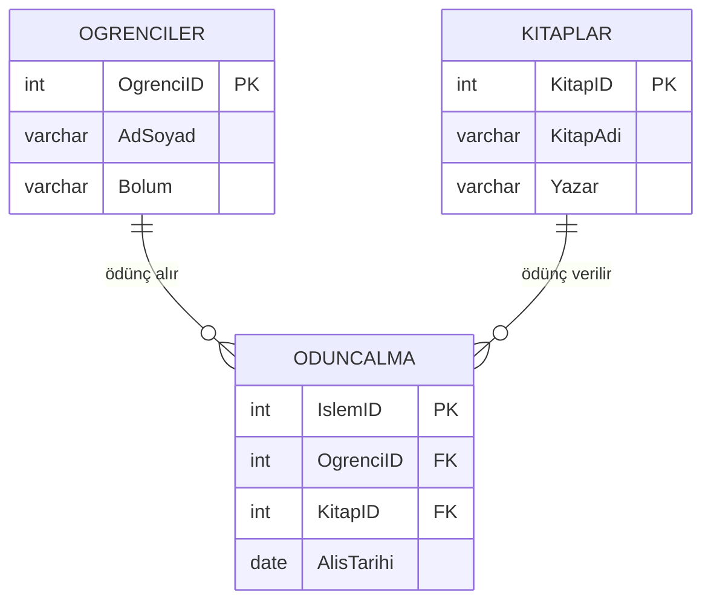
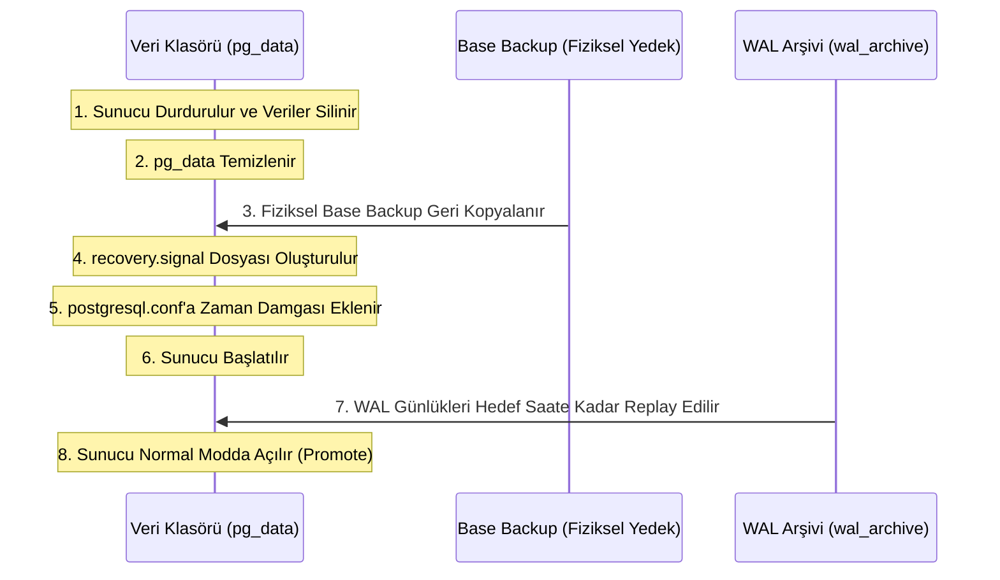

# Veritabanı Yedekleme ve Felaketten Kurtarma Planı Raporu

**Ders**: BLM4522 Veritabanı Yönetim Sistemleri  
**Proje**: Proje-2: Veritabanı Yedekleme ve Felaketten Kurtarma Planı  
**Veritabanı**: Üniversite Kütüphane Sistemi (`kutuphanedb`)  

---

## İçindekiler
1. [Giriş ve Veritabanı Mimarisi](#1-giriş-ve-veritabanı-mimarisi)
2. [PostgreSQL Kurtarma Modelleri (Recovery Models)](#2-postgresql-kurtarma-modelleri-recovery-models)
3. [Tam Yedekleme (Full Backup) Stratejileri](#3-tam-yedekleme-full-backup-stratejileri)
4. [Fark Yedeklemesi (Differential Backup) Konsepti ve PostgreSQL Alternatifleri](#4-fark-yedeklemesi-differential-backup-konsepti-ve-postgresql-alternatifleri)
5. [İşlem Günlüğü (Transaction Log / WAL) Yedeklemesi ve Yönetimi](#5-işlem-günlüğü-transaction-log--wal-yedeklemesi-ve-yönetimi)
6. [Belirli Bir Ana Geri Yükleme (Point-in-Time Recovery - PITR)](#6-belirli-bir-ana-geri-yükleme-point-in-time-recovery---pitr)
7. [Veri Kaybı Senaryoları ve Canlı Testler](#7-veri-kaybı-senaryoları-ve-canlı-testler)
8. [Felaket Kurtarma Planı (Disaster Recovery Plan) ve Adımları](#8-felaket-kurtarma-planı-disaster-recovery-plan-ve-adımları)
9. [Yedek Doğrulama (Backup Verification) Teknikleri](#9-yedek-doğrulama-backup-verification-teknikleri)
10. [Otomatik Zamanlanmış Yedekleme (Zamanlayıcılar / Schedulers)](#10-otomatik-zamanlanmış-yedekleme-zamanlayıcılar--schedulers)
11. [Veritabanı Yansıtma (Database Mirroring) ve Çoğaltma (Replication) Alternatifleri](#11-veritabanı-yansıtma-database-mirroring-ve-çoğaltma-replication-alternatifleri)

---

## 1. Giriş ve Veritabanı Mimarisi

Bu projede, bir **Üniversite Kütüphane Sistemi** ele alınmıştır. Sistem, kütüphane işlemlerinin ilişkisel kurallara uygun olarak yürütülmesini sağlayan 3 temel tablodan oluşmaktadır:
- **Ogrenciler**: Kütüphaneye üye olan öğrencilerin bilgilerini tutar.
- **Kitaplar**: Kütüphanedeki kitapların envanter bilgisini saklar.
- **OduncAlma**: Hangi öğrencinin hangi kitabı ne zaman ödünç aldığını takip eden ilişkisel (transactional) tablodur.

### Tablo İlişkileri ve Şema Tanımı
Veritabanı şeması tasarlanırken ilişkisel bütünlüğü (Referential Integrity) korumak adına Yabancı Anahtar (Foreign Key) kısıtlamaları ve silme işlemlerinde veri tutarlılığını sağlamak için `ON DELETE CASCADE` kuralları eklenmiştir.



---

## 2. PostgreSQL Kurtarma Modelleri (Recovery Models)

Microsoft SQL Server'da bulunan "Simple", "Full" ve "Bulk-Logged" recovery modelleri, PostgreSQL dünyasında doğrudan **Write-Ahead Logging (WAL)** seviyeleri ve arşivleme modları ile karşılık bulur.

| SQL Server Modeli | PostgreSQL Karşılığı | Açıklama |
| :--- | :--- | :--- |
| **Simple** | `wal_level = minimal` / `archive_mode = off` | Günlük dosyaları sadece kilitlenmeleri (crash recovery) önlemek için yazılır. Belirli bir ana dönülemez (PITR yapılamaz). |
| **Full** | `wal_level = replica` / `archive_mode = on` | Tüm işlemler WAL günlüklerine kaydedilir ve bu günlükler güvenli bir arşiv dizinine taşınır. PITR ve Replication desteği tamdır. |
| **Bulk-Logged** | `wal_level = replica` (Bulk optimizasyonlu) | PostgreSQL büyük veri yüklemelerini (örn: `COPY`) de WAL günlüğüne yazar ancak işlem bazında optimizasyonlar otomatik yapılır. |

> [!NOTE]
> Bu projede Point-in-Time Recovery (PITR) testlerinin yapılabilmesi için sistemimiz **Full Recovery** eşdeğeri olan `wal_level = replica` ve `archive_mode = on` modunda yapılandırılmıştır.

---

## 3. Tam Yedekleme (Full Backup) Stratejileri

Tam yedekleme, veritabanının belirli bir andaki şema yapısının ve tüm verilerinin eksiksiz bir kopyasını almaktır. PostgreSQL'de iki farklı tam yedekleme yöntemi mevcuttur:
1. **Mantıksal Yedekleme (Logical Backup - `pg_dump`)**: Veritabanı nesnelerini oluşturacak SQL komutlarını veya özel sıkıştırılmış formatları (`custom format`) dışarı aktarır.
2. **Fiziksel Yedekleme (Physical Backup - `pg_basebackup`)**: Veritabanının ham disk bloklarını ve veri dizinini (data directory) fiziksel olarak kopyalar.

### Proje Uygulaması
Mantıksal tam yedekleme işlemi için yazdığımız `full_backup.sh` betiğinde `pg_dump` aracı kullanılmıştır:
```bash
pg_dump -h localhost -d kutuphanedb -F c -f ./backups/kutuphanedb_full.dump
```
- `-F c` parametresiyle oluşturulan **Custom Format** yedekler, sadece veriyi veya şemayı seçerek geri yükleyebilme, paralel geri yükleme yapabilme ve maksimum sıkıştırma avantajları sunar.

---

## 4. Fark Yedeklemesi (Differential Backup) Konsepti ve PostgreSQL Alternatifleri

SQL Server'da yerleşik olarak bulunan `BACKUP DATABASE ... WITH DIFFERENTIAL` komutu, en son alınan tam yedeklemeden sonra değişen veri sayfalarını yedekler. 

### PostgreSQL'de Fark Yedeklemesi Nasıl Yapılır?
PostgreSQL çekirdeğinde yerleşik mantıksal bir "fark yedekleme" komutu yoktur. Ancak kurumsal seviyede bu ihtiyaç şu yöntemlerle çözülür:
1. **Fiziksel Fark Araçları (pgBackRest / Barman)**: Blok seviyesinde tarama yaparak sadece değişen blokları yedekleyen harici araçlardır.
2. **Mantıksal Fark (Simülasyon)**: Tablolardaki artan ID'ler veya son güncellenme tarihlerini (`updated_at`) sorgulayarak sadece yeni kayıtları dışarı aktaran özel betikler.

### Proje Uygulaması (Mantıksal Fark Simülasyonu)
Yazdığımız `differential_backup.sh` betiği, tam yedekten sonra kütüphane sistemine eklenen yeni kitapları, öğrencileri ve ödünç alma işlemlerini algılar ve bunları `INSERT ... ON CONFLICT DO NOTHING` SQL formatında `./backups/kutuphanedb_diff.sql` dosyasına kaydeder.
Bu sayede felaket anında önce tam yedek geri yüklenir, ardından fark SQL betiği çalıştırılarak en güncel duruma ulaşılır.

---

## 5. İşlem Günlüğü (Transaction Log / WAL) Yedeklemesi ve Yönetimi

PostgreSQL'deki **Write-Ahead Log (WAL)** dosyaları, veritabanında yapılan her türlü değişikliği (INSERT, UPDATE, DELETE, vb.) diske kalıcı olarak yazılmadan önce sırayla kaydeden işlem günlükleridir. 

### WAL Arşivleme Mekanizması
WAL günlükleri varsayılan olarak 16 MB boyutundaki segmentler halinde yazılır. Bu dosyalar dolduğunda veya zorlandığında (`pg_switch_wal()`), veritabanı bunları otomatik olarak arşiv dizinine kopyalar.

`postgresql.conf` üzerindeki arşivleme ayarları:
```ini
wal_level = replica
archive_mode = on
archive_command = 'cp %p /Users/aleyna/Desktop/BLM4522/Final/Proje-2/wal_archive/%f'
```
- `%p`: Sunucudaki güncel WAL dosyasının yolu.
- `%f`: Arşiv klasörüne yazılacak WAL dosyasının adı.

---

## 6. Belirli Bir Ana Geri Yükleme (Point-in-Time Recovery - PITR)

Point-in-Time Recovery (PITR), fiziksel bir tam yedek (Base Backup) ve bu yedekten sonra üretilen WAL günlüklerini kullanarak veritabanını geçmişteki **tam bir saniyeye** geri döndürme işlemidir.

### PITR Kurtarma Süreci Çalışma Prensibi



1. **Base Backup Geri Yükleme**: Sunucu kapatılır, aktif veri klasörü silinir ve temiz base backup kopyalanır.
2. **Kurtarma Modunu Tetikleme**: Veri klasöründe boş bir `recovery.signal` dosyası oluşturulur.
3. **Parametreleri Tanımlama**: `postgresql.conf` içine kurtarma hedefleri yazılır:
   ```ini
   restore_command = 'cp /yol/wal_archive/%f %p'
   recovery_target_time = '2026-06-04 18:53:15'
   recovery_target_action = 'promote'
   ```
4. **Sunucuyu Başlatma**: PostgreSQL başlatıldığında `recovery.signal` dosyasını algılar, arşivdeki WAL segmentlerini belirtilen hedef saate kadar tek tek işler (replay) ve hedeflenen saniyede durarak veritabanını normal kullanıma açar (`promote`).

---

## 7. Veri Kaybı Senaryoları ve Canlı Testler

Yazdığımız betikler ve SQL dosyaları ile iki ana veri kaybı ve kurtarma senaryosu başarıyla simüle edilmiştir.

### Senaryo 1: Tam + Fark Yedekleme ve Kurtarma Testi
1. Veritabanı kuruldu (`database_setup.sql`) ve 15'er kayıt eklendi.
2. Tam yedek alındı (`full_backup.sh`).
3. Yeni bir kitap eklendi:
   ```sql
   INSERT INTO Kitaplar VALUES (10, 'Veritabani Sistemleri', 'Elmasri');
   ```
4. Fark yedeklemesi alındı (`differential_backup.sh`).
5. **Felaket**: `DROP TABLE Kitaplar CASCADE;` komutu ile tablo ve tüm ilişkisel bağlantıları silindi.
6. **Geri Yükleme**:
   - `restore_full.sh` çalıştırıldı (Veritabanı sıfırlandı, şema ve ilk 15 kayıt geri geldi).
   - Fark yedek dosyası (`kutuphanedb_diff.sql`) uygulandı.
7. **Sonuç**: Kitaplar tablosu ve sonradan eklenen 10 nolu "Veritabanı Sistemleri" kaydı eksiksiz olarak kurtarıldı.

### Senaryo 2: Point-in-Time Recovery (PITR) Testi
1. İzole bir test kümesi port 5433 üzerinde başlatıldı ve base backup alındı (`pitr_setup.sh`).
2. Yeni veri eklendi (Saat **18:53:15.526**).
3. **Felaket**: Tablo yanlışlıkla silindi (Saat **18:53:17**).
4. WAL dosyası arşivlendi (`SELECT pg_switch_wal();`).
5. **Geri Yükleme**: `pitr_restore.sh` çalıştırıldı. Sunucu kapatıldı, base backup açıldı, `recovery.signal` oluşturuldu ve hedef zaman olarak **18:53:15.526** tanımlandı.
6. **Sonuç**: PostgreSQL logları işleyerek silme işleminden hemen önceki saliseye geri döndü. Tablo ve eklenen veri başarıyla kurtarıldı.

---

## 8. Felaket Kurtarma Planı (Disaster Recovery Plan) ve Adımları

Olası bir gerçek felaket (sunucu çökmesi, disk bozulması vb.) durumunda takip edilecek standart acil durum protokolü şu şekildedir:

1. **Hasar Tespiti**: Sunucunun donanımsal veya yazılımsal durumunun kontrol edilmesi, aktif verilerin tutarlılık durumunun taranması.
2. **Hizmet Askıya Alma**: Veri tabanının daha fazla bozulmasını önlemek için harici bağlantıların kesilmesi.
3. **Yedeklerin Hazırlanması**: En son alınan başarılı Tam (Full), Fark (Differential) ve arşivlenmiş WAL dosyalarının güvenli bir alana taşınması.
4. **Kurtarma Altyapısının Kurulması**: Gerekirse yeni bir sunucunun veya yedek (standby) sunucunun devreye sokulması.
5. **Aşamalı Geri Yükleme**:
   - Tam yedek yüklenir.
   - Son fark yedeği uygulanır.
   - En son WAL dosyaları PITR yöntemiyle hedeflenen saate kadar uygulanır.
6. **Doğrulama ve Canlıya Geçiş**: Verilerin tutarlılığı sorgularla kontrol edilir ve uygulamalar tekrar veritabanına bağlanır.

---

## 9. Yedek Doğrulama (Backup Verification) Teknikleri

Yedeklerin alınması kadar, bu yedeklerin gerektiğinde çalışacağından emin olmak (Recovery Assurance) kritik önem taşır.

- **Otomatik `RESTORE` Testleri (Sandbox Restores)**: Her gün alınan yedeklerin otomatik olarak izole bir test sunucusuna restore edilmesi ve hata verip vermediğinin doğrulanması (Bu projede port 5433 üzerinde yaptığımız test bu yöntemin birebir örneğidir).
- **Checksum Doğrulaması**: PostgreSQL fiziksel yedeklerinde `pg_checksums` aracı kullanılarak disk bloklarındaki bozulmaların (bit rot) tespit edilmesi.
- **Mantıksal Karşılaştırma**: Geri yüklenen test veritabanındaki satır sayılarının ve kritik tabloların MD5 özetlerinin (hash) asıl sunucu ile otomatik karşılaştırılması.

---

## 10. Otomatik Zamanlanmış Yedekleme (Zamanlayıcılar / Schedulers)

Gerçek üretim ortamlarında yedekleme süreçleri insan inisiyatifine bırakılamaz ve otomatik zamanlayıcılar yardımıyla çalıştırılır. macOS ve Linux sistemlerinde bu işlem **cron** servisi ile gerçekleştirilir.

### Cron Yapılandırma Örneği
Sistemde her gün gece 02:00'de tam yedek, saat başı fark yedeği ve her 10 dakikada bir WAL arşiv temizliği yapmak için `crontab -e` komutu ile şu tanımlamalar yapılır:

```cron
# Her gün gece 02:00'de Tam Yedek al ve günlüğe yaz
0 2 * * * /Users/aleyna/Desktop/BLM4522/Final/Proje-2/full_backup.sh >> /Users/aleyna/Desktop/BLM4522/Final/Proje-2/backups/backup_log.txt 2>&1

# Her saat başında Fark (Differential) Yedek al
0 * * * * /Users/aleyna/Desktop/BLM4522/Final/Proje-2/differential_backup.sh >> /Users/aleyna/Desktop/BLM4522/Final/Proje-2/backups/backup_log.txt 2>&1
```

---

## 11. Veritabanı Yansıtma (Database Mirroring) ve Çoğaltma (Replication) Alternatifleri

Sunucu düzeyinde anlık felaket kurtarma ve yüksek kullanılabilirlik (High Availability) sağlamak için yedekleme haricinde aktif replikasyon yöntemleri kullanılır.

### 1. Fiziksel Replikasyon (Streaming Replication)
Ana sunucudaki (Primary) WAL kayıtlarını ağ üzerinden anlık olarak yedek sunucuya (Standby) gönderir. Yedek sunucu "Read-Only" (Sadece Okunabilir) durumdadır. Sunucu çöktüğünde yedek sunucu saniyeler içinde "Primary" moduna yükseltilebilir (Failover).

### 2. Mantıksal Replikasyon (Logical Replication)
Yayıncı (Publisher) ve Abone (Subscriber) modeli ile çalışır. Sadece belirli tabloların veya satırların başka bir veritabanına replike edilmesini sağlar. Farklı PostgreSQL sürümleri arasında veya veri ambarı (Data Warehouse) beslemede tercih edilir.

---

## Sonuç
Bu çalışma kapsamında, kurumsal veritabanı yönetim sistemlerinde veri kaybını en aza indirmek ve felaket durumlarında en hızlı şekilde ayağa kalkabilmek için gerekli olan yedekleme stratejileri teorik ve pratik olarak incelenmiştir. PostgreSQL üzerinde geliştirilen mantıksal full/fark yedekleme betikleri ile fiziksel WAL tabanlı PITR mekanizması, tasarlanan Üniversite Kütüphane Sistemi veritabanı üzerinde başarıyla test edilmiş ve veri kurtarma adımları doğrulanmıştır.
