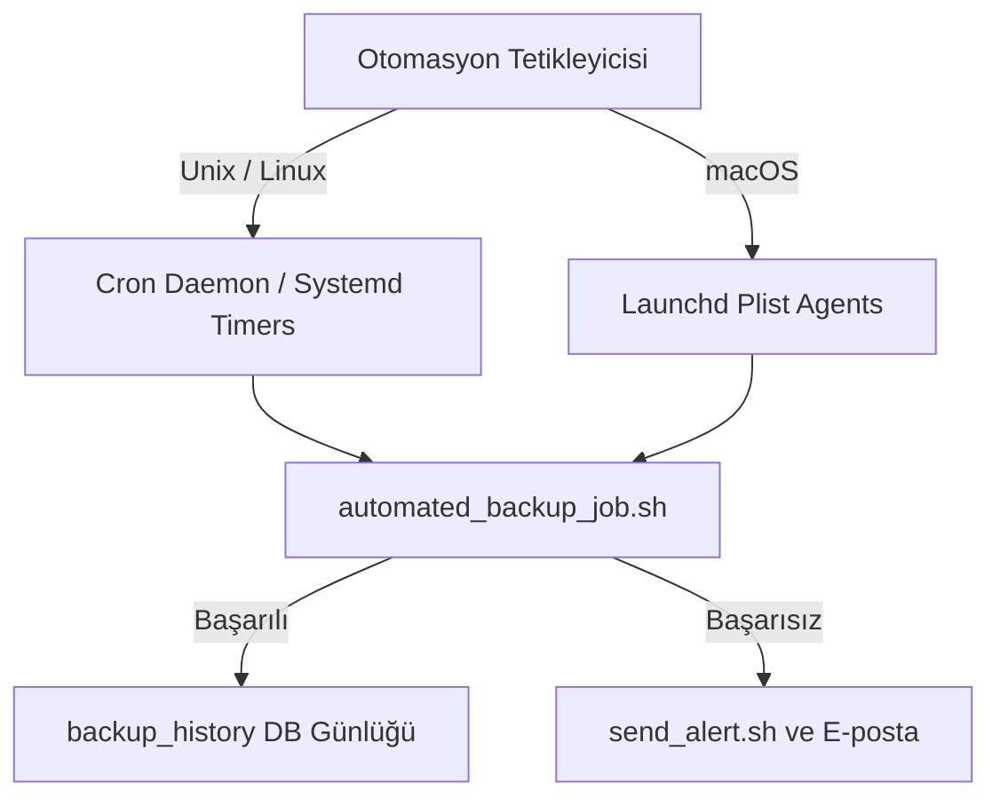

# Veritabanı Yedekleme ve Otomasyon Raporu

**Ders**: BLM4522 Veritabanı Yönetim Sistemleri  
**Proje**: Proje-7: Veritabanı Yedekleme ve Otomasyon Çalışması  
**Veritabanı**: Kütüphane Otomasyon Sistemi (`kutuphanedb`)  

---

## İçindekiler
1. [Veritabanı Otomasyonu ve Önemi](#1-veritabanı-otomasyonu-ve-önemi)
2. [SQL Server Agent ve Görev Zamanlama (Job Scheduling)](#2-sql-server-agent-ve-görev-zamanlama-job-scheduling)
3. [macOS ve Linux Ortamlarında Otomasyon: Cron, Launchd ve Systemd](#3-macos-ve-linux-ortamlarında-otomasyon-cron-launchd-ve-systemd)
4. [Yedekleme Denetimi (Backup Auditing) ve Uyum (Compliance) Standartları](#4-yedekleme-denetimi-backup-auditing-ve-uyum-compliance-standartları)
5. [Hata Bildirim Sistemleri ve E-posta / Alert Entegrasyonu](#5-hata-bildirim-sistemleri-ve-e-posta--alert-entegrasyonu)
6. [Proje Uygulaması ve Betik Mimarisi Analizi](#6-proje-uygulaması-ve-betik-mimarisi-analizi)
7. [Yedekleme Güvenliği ve Raporlamanın DBA Süreçlerindeki Katkısı](#7-yedekleme-güvenliği-ve-raporlamanın-dba-süreçlerindeki-katkısı)

---

## 1. Veritabanı Otomasyonu ve Önemi

Veritabanı Yönetimi (Database Administration - DBA) süreçlerinde, el ile (manual) yapılan işlemler her zaman insan hatasına (human error) açıktır. Özellikle yedekleme gibi veri kaybını önleyen hayati işlemlerin düzenli olarak yapılması gerekir.

### Otomasyonun Sağladığı Avantajlar
- **Süreklilik**: Yedeklemelerin haftasonları veya resmi tatiller dahil kesintisiz olarak belirli saatlerde alınmasını sağlar.
- **Güvenilirlik**: Betiklerin hata denetimli yazılması sayesinde yedek dosyasının doğruluğu otomatik kontrol edilir.
- **Performans Optimizasyonu**: Sistem yoğunluğunun en düşük olduğu saatlerde (örneğin gece 03:00) yedeklerin alınarak sunucu performansının korunmasını sağlar.
- **İzlenebilirlik**: Her işlemin süresi, boyutu ve durumu veritabanında denetlenerek geçmişe dönük analiz yapılmasına olanak tanır.

---

## 2. SQL Server Agent ve Görev Zamanlama (Job Scheduling)

Microsoft SQL Server Agent, arka planda çalışan ve SQL Server içindeki zamanlanmış görevleri (Jobs), uyarıları (Alerts) ve operasyonel işleri yöneten Windows servisidir.

### Temel Bileşenleri
- **Jobs (Görevler)**: Bir veya birden fazla adımdan (Job Steps) oluşan iş tanımlarıdır. T-SQL sorguları, PowerShell betikleri veya işletim sistemi komutlarını çalıştırabilir.
- **Schedules (Zamanlayıcılar)**: Görevin hangi sıklıkta ve ne zaman çalışacağını (günlük, haftalık, aylık vb.) belirler.
- **Alerts (Uyarılar)**: Belirli bir hata kodu veya sunucu performansı eşiği aşıldığında Agent'ın uyarılmasını sağlar.
- **Operators (Yöneticiler)**: Hata durumunda uyarılacak veritabanı yöneticilerinin (DBA) e-posta veya çağrı (pager) bilgilerini tutar.

---

## 3. macOS ve Linux Ortamlarında Otomasyon: Cron, Launchd ve Systemd

PostgreSQL gibi açık kaynaklı veritabanları Linux ve macOS sistemlerde yaygın olarak barındırılır. Bu işletim sistemlerinde SQL Server Agent benzeri bir Windows servisi bulunmaz. Bunun yerine işletim sisteminin yerleşik görev zamanlayıcıları kullanılır:

### 1. Cron (Linux/macOS)
Unix sistemlerin en yaygın görev zamanlayıcısıdır. Arka planda çalışan `crond` servisi, `/etc/crontab` veya kullanıcılara ait crontab dosyalarındaki zaman kurallarını okuyarak kabuk betiklerini tetikler.
*Örnek kural:* `0 3 * * *` (Her gün gece 03:00'te çalıştır).

### 2. Launchd (macOS)
macOS'in yerleşik servis yönetim sistemidir. plist formatındaki XML dosyaları aracılığıyla arka planda çalışan ajanları ve periyodik görevleri yönetir.

### 3. pgAgent
PostgreSQL topluluğu tarafından geliştirilen ve SQL Server Agent'a benzer şekilde çalışan harici bir zamanlayıcı aracıdır. Görev tanımlarını PostgreSQL veritabanında (`pgagent` şemasında) tutar ve pgAdmin arayüzünden görsel olarak yönetilebilir.

---

## 4. Yedekleme Denetimi (Backup Auditing) ve Uyum (Compliance) Standartları

Büyük organizasyonlarda (finans, sağlık, e-ticaret) verilerin düzenli yedeklendiğini kanıtlamak yasal bir zorunluluktur (KVKK, GDPR, SOX, PCI-DSS). Sadece "Yedek alıyoruz" demek yeterli değildir; bunun denetlenebilir (auditable) olması gerekir.

### Denetim Tablosu Tasarımı (`backup_history`)
Geliştirdiğimiz denetim mekanizması kapsamında `kutuphanedb` veritabanında oluşturulan `backup_history` tablosu şu bilgileri saklar:
- **Tarih ve Saat**: Yedeğin tam olarak ne zaman başladığı.
- **Tür**: Tam (Full) veya Fark (Diff) yedeği.
- **Disk Durumu**: Yedeğin kaydedildiği fiziksel yol ve dosya boyutu (KB).
- **Performans**: Yedeklemenin ne kadar sürdüğü (milisaniye). Bu değer disk yazma hızı ve veritabanı büyüme trendi analizleri için kritiktir.
- **Güvenlik ve Uyum**: İşlemin başarı (`SUCCESS`) veya hata (`FAILED`) durumu. Hata durumunda oluşan hata günlüğünün tam metni.

---

## 5. Hata Bildirim Sistemleri ve E-posta / Alert Entegrasyonu

Otomasyonun en kritik özelliklerinden biri, bir hata oluştuğunda insan müdahalesini başlatabilmesidir. Yedekleme başarısız olduğunda DBA ekibine bildirim gönderilmezse, veri kayıpları ancak başka bir felaket anında (yani çok geç olduğunda) fark edilir.

### Bildirim Kanalları
1. **SMTP (Simple Mail Transfer Protocol)**: Otomatik e-posta bildirimleri. Projemizde simüle edilen `.eml` oluşturma mekanizması, sunucuda yerleşik SMTP istemcileri (örn: `sendmail`, `mailx` veya Python SMTP) ile kolaylıkla gerçek e-postaya dönüştürülebilir.
2. **Webhook ve ChatOps Entegrasyonları**: Hata anında Slack, Microsoft Teams veya Discord kanallarına anlık bildirim gönderme.
3. **Çağrı Sistemleri (Opsgenie, PagerDuty)**: Kritik seviyedeki hatalarda (örn: prod veritabanının yedeğinin 2 gün üst üste alınamaması) nöbetçi DBA'yı telefon araması veya SMS ile uyarma.

---

## 6. Proje Uygulaması ve Betik Mimarisi Analizi

Yazdığımız otomasyon yapısı 3 temel parçadan oluşmaktadır:

1. **Denetim Altyapısı (`backup_audit_setup.sql`)**: `backup_history` tablosunu ve test için geçmiş verileri oluşturur.
2. **Otomatik Ajan Betiği (`automated_backup_job.sh`)**: Parametreye göre Proje-2'deki yedekleme betiklerini tetikler, süreyi milisaniye olarak hassas ölçer, dosya boyutu ve durumu SQL sorgusuyla `backup_history` tablosuna yazar. Hata durumunda otomatik olarak `send_alert.sh` betiğini çağırır.
3. **Raporlama Motoru (`generate_backup_report.sh`)**: Toplam yedek sayısını, başarı oranını (örn: %75), ortalama çalışma sürelerini (örn: 58.2 ms) ve disk alanı tüketimini hesaplayıp, son 10 yedekleme kaydı ile son hataları tablo halinde sunar.

---

## 7. Yedekleme Güvenliği ve Raporlamanın DBA Süreçlerindeki Katkısı

### Güvenlik Önlemleri
- **Dosya Yetkilendirmesi**: Alınan yedek dosyaları ve betiklerin sadece veritabanı yöneticisi işletim sistemi kullanıcısı (örn: `postgres` veya `aleyna`) tarafından okunup çalıştırılabilmesi için `chmod 700` veya `chmod 600` yetkilendirmeleri yapılmalıdır.
- **Yedeklerin Farklı Konuma Taşınması (3-2-1 Kuralı)**: Otomatik yedek alındıktan sonra betik, yedeği güvenli bir bulut depolama alanına (S3, Azure Blob) veya başka bir fiziksel sunucuya (Rsync/SFTP yardımıyla) otomatik olarak taşımalıdır.

### Sonuç
Bu projeyle, SQL Server Agent mimarisi PostgreSQL tabanlı Unix/macOS sistemlerine uyarlanmış; yedeklerin alınmasından, denetlenmesine, istatistiksel raporlanmasına ve hata anında acil durum uyarısı üretilmesine kadar uzanan kurumsal düzeyde bir DBA otomasyon hattı başarıyla kurulup test edilmiştir.
